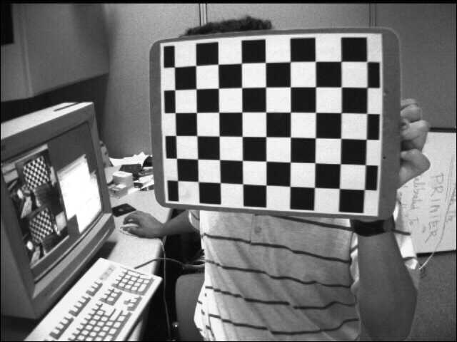
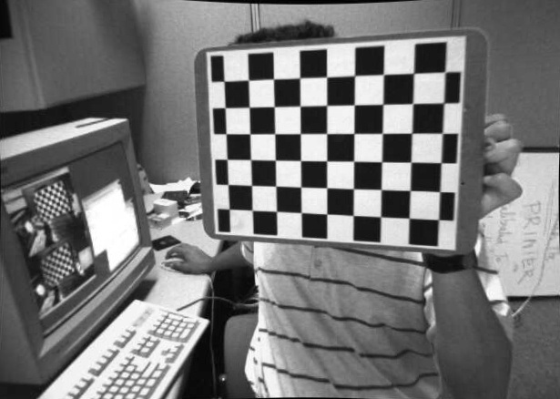

# Stereo

### Brief

This is a repo related to stereo matching including some implementation of basic knowledge and model.

### Acquire

+ Python >= 3.5.2
+ OpenCV >= 3.3.1
+ NumPy >= 1.13.1
+ jupyter-notebook

### Detail

#### Calibration & Undistort

The calibration and undistort are implemented in this part. Firstly a calibration will be done by using several images from "./left", and then the images in "./left" well be undistorted and written in "./undistort".

You just need to use jupyter-notebook to open the **Calibration_Undistort.ipynb** and run the corresponding code block.

Here is an example of the result, 

 