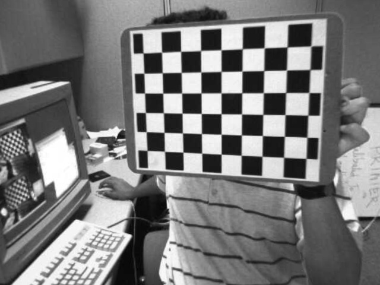

# Stereo

### Brief

This is a repo related to stereo matching including some implementation of basic knowledge and model.

### Acquire

+ OpenCV >= 3.3.1
+ Python >= 3.5.2
+ NumPy >= 1.13.1
+ CMake >= 3.7
+ Make >= 3.81
+ jupyter-notebook

### Detail

#### Calibration & Undistort

#####  ./python/Calibration_Undistort.ipynb

The calibration and undistort are implemented in this part. Firstly a calibration will be done by using several images from "./img/left", and then the images in "./img/left" well be undistorted and written in "./img/left_undistort".

You just need to use jupyter-notebook to open the **./python/Calibration_Undistort.ipynb** and run the corresponding code block.

Here is an example of the result, 





#### Stereo Calibration 

##### ./python/Stereo_Calibration.ipynb

The stereo calibration is implemented in this part, from this part, not only the camera matrix, distort coefficient, but also the transform between two cameras will be calibrate.

To run this code, just open the **./python/Stereo_Calibration.ipynb** by Jupiter-notebook.


#### Rectification 

##### ./code/StereoRectification.h

This recitification part is implmented by C++, to runing the code, you need first change directory to ```./code```, then

```
cmake ./cmake-build-debug
cd cmake-build-debug
make
./code -rect
```

Here is the result

